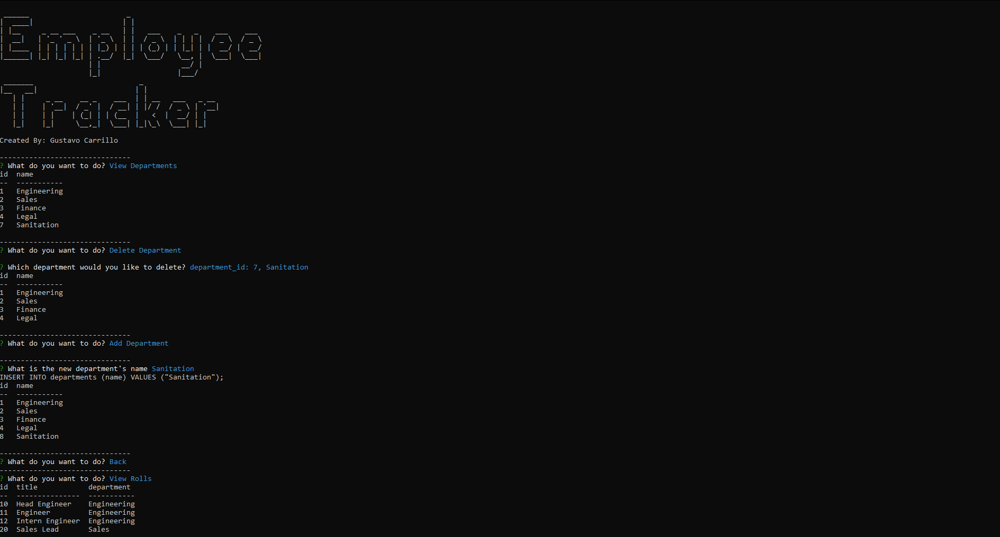

# Employee Tracker

<p align="center"></p>

## Description

This CLI application is designed to track, manage and take care of employees, rolls and departments. The application guides the user through prompts to preform various actions on the budsiness database. This type of application was desgined to make managing employees much simpler for small businesses. This app shows my ability to use MySQL queries as well as my ability to use JavaScript.

## Table of Contents
 - [Usage](#usage)
 - [Credits](#credits)
 - [License](#license)
 - [Questions](#questions)

## Usage

[how -to-use-employee-tracker.webm](https://user-images.githubusercontent.com/115580058/221563049-cd51951f-fc78-48a5-b48f-989d3916fba6.webm)

The web application will guide you through the different functions of the application by prompting you with different options and questions. To start, open the CLI and go into the main directory of the application. Then type in ```npm start```.

## Credits

credits go to the Fullstack Flex Bootcamp

## License

This project is under the MIT License

## Questions
     
Please contact me through the following:

 - [GitHub Profile](https://github.com/0zrk23)
 - [Email](gus.carrillo1221@gmail.com)
